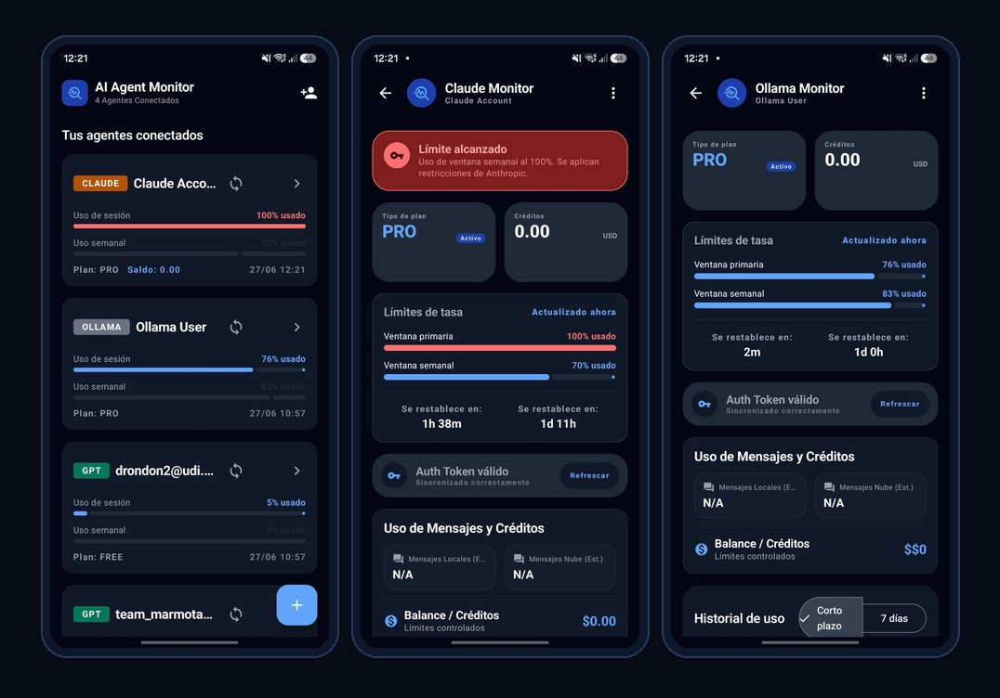

# AI Agent Monitor — Android Usage & Rate Limit Tracker for ChatGPT, Claude, and Ollama

AI Agent Monitor is a Kotlin Android app for tracking AI usage, rate limits, session windows, weekly limits, credits, and account status across ChatGPT, Anthropic Claude, and Ollama Cloud from one mobile dashboard.

It is built for people who use multiple AI accounts and need a quick way to see which account is close to its limit, which session needs re-authentication, and when each provider window resets.



## What it does

AI Agent Monitor helps you track session windows, weekly windows, plan type, credits, reset times, and expired sessions for multiple AI providers. Instead of opening ChatGPT, Claude, and Ollama separately, you get one Android dashboard that shows your connected AI accounts side by side.

## Supported providers

| Provider | Tracks | Authentication |
| --- | --- | --- |
| ChatGPT / OpenAI | Session usage, weekly usage, plan, credits | Embedded WebView session capture |
| Anthropic Claude | Session usage, weekly usage, plan, reset windows | Embedded WebView session capture |
| Ollama Cloud | Session usage, weekly usage, plan state | Embedded WebView session capture |

## Features

- **AI rate limit tracking**: monitor usage windows before a provider blocks or throttles your account.
- **Multi-provider monitoring**: ChatGPT / OpenAI, Anthropic Claude, and Ollama Cloud in one dashboard.
- **Multiple accounts per provider**: connect two ChatGPT accounts, two Ollama accounts, etc. and monitor them independently.
- **Session persistence**: authenticate once; credentials are stored locally and replayed on each sync. Re-login only when a session actually expires.
- **Re-auth on expiry**: when a provider returns 401/403 (or Ollama redirects to its sign-in page), the account card shows a "Sesión expirada" state with a one-tap re-authenticate button.
- **Live usage charts**: primary and weekly usage history with tokenized, accessible rendering.
- **Dark mode**: semantic color tokens swap per system theme; provider brand colors stay consistent.
- **Accessibility**: WCAG AA contrast on provider badges, screen-reader content descriptions, touch targets ≥ 36dp, keyboard/dismiss affordances.

## Download APK

APK builds are attached to GitHub Releases. Open the latest release and download the `AI-Agent-Monitor-*.apk` artifact.

> Release APKs are generated by GitHub Actions. If signing secrets are not configured, the workflow publishes a debug APK artifact for testing.

## Prerequisites

- [Android Studio](https://developer.android.com/studio) (Ladybug or newer)
- JDK 17+ (bundled with Android Studio)
- An Android device or emulator (min SDK 24)

## Run locally

1. **Open** the project in Android Studio (`Open` → select this directory).
2. Let Gradle sync finish — it will download dependencies and generate the Gradle wrapper.
3. Connect a device (USB debugging enabled) or start an emulator.
4. Press **Run** (green triangle), or from the terminal:
   ```bash
   ./gradlew assembleDebug
   adb install app/build/outputs/apk/debug/app-debug.apk
   ```

## How authentication works

This app does **not** use native Google Sign-In. Each provider (ChatGPT, Claude, Ollama) has its own web login, so authentication happens through an embedded WebView that captures the provider's session credential (Bearer token for ChatGPT, `sessionKey` cookie for Claude, `session=` cookie for Ollama).

- On first connect, the WebView opens the provider's login page; once you sign in, the credential is captured and stored locally (Room).
- On every subsequent sync, the stored credential is replayed — no WebView, no re-login, unless the session expired.
- When a session expires, the account card surfaces a "Sesión expirada" state with a re-authenticate button. Re-authenticating updates the existing account in place (no duplicate rows).

Credentials never leave the device.

## Architecture

```
app/src/main/java/com/example/
├── data/            Room database, DAOs, Repository, Account/UsageLog entities
├── network/         SyncResult sealed type + ChatGPT/Claude/Ollama services
├── ui/
│   ├── theme/       DesignTokens (3-tier token bridge), Color/Type/Theme
│   ├── navigation/  NavRoute sealed router
│   ├── screens/     OnboardingScreen, DashboardScreen, AccountDetailScreen
│   └── components/  ProviderBadge, AgentOverviewCard, RateLimitCard,
│                    CreditsCard, SectionHeader, ErrorBanner, UsageChart
└── MainActivity.kt
```

- **Tokens**: a single `DesignTokens.kt` object is the source of truth for color, spacing, radius, typography, and motion. Theme/Color/Type delegate to it; components consume it directly (no hardcoded hex outside the token layer).
- **Navigation**: a sealed `NavRoute` (`Onboarding | Dashboard | AccountDetail(id)`) drives a lightweight `AnimatedContent` router in `MainScreen`. No Navigation-Compose dependency.
- **State**: `MainViewModel` exposes `StateFlow`s collected via `collectAsStateWithLifecycle`; screens are stateless and take `(state, callbacks, modifier)`.
- **Auth expiry**: services return a typed `SyncResult<T>` (`Success | AuthExpired | NetworkError | ParseError`); the ViewModel reconciles the expired account id into an `expiredAccounts: StateFlow<Set<Int>>` that the UI renders as the re-auth state.

## Testing

JVM unit tests (no device required):

```bash
./gradlew testDebugUnitTest
```

Covers: `SyncResult` mapping per provider, Ollama expiry predicate (fixture-based), upsert-by-`(provider,userId)` (Room), re-auth flow (Compose UI), NavRoute state machine, and component rendering.

Instrumented/E2E tests require a device or emulator and are not part of the fast test loop.

## Build the APK

```bash
./gradlew assembleDebug
# Output: app/build/outputs/apk/debug/app-debug.apk
```

For a release build, configure a keystore via environment variables (`KEYSTORE_PATH`, `STORE_PASSWORD`, `KEY_PASSWORD`) — the `release` signing config in `app/build.gradle.kts` reads them.

## Tech stack and search terms

Android AI usage monitor, ChatGPT rate limit tracker, Claude usage tracker, Ollama Cloud monitor, Kotlin Jetpack Compose Android app, AI account dashboard, OpenAI usage tracking, Anthropic Claude monitoring.

## License

See the project's license file if present.
